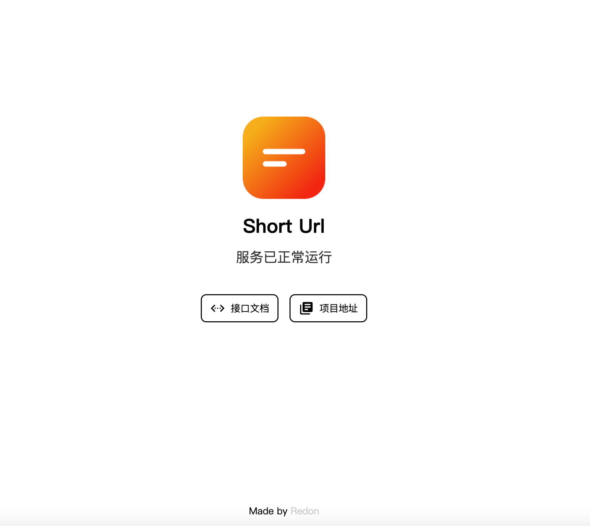

# 短链服务 API



用于短链生成服务

## 接口文档

P.S. 身份认证 `Secret-key` 值对应项目环境变量中的 `SECRET_KEY`

<details>
<summary>生成短链</summary>

#### 接口： `[POST]` `/api/url/shorten`

Header 参数

- `Secret-key`: string（调用身份验证） ，必填，示例值：`YOUR_SECRET_KEY`

Body 参数（application/json）

- `url`：string （链接），必填，示例值：`http://www.baidu.com`
- `remark`：string（备注），可选，示例值：`百度`
- `extendsStr`：string（扩展字段），可选，示例值：`{}`

返回数据（application/json）

```json
{
  "data": {
    "id": 1,
    "url": "http://www.baidu.com",
    "uniqueCode": "RfEtvA",
    "shortUrl": "s.isee4.cn/RfEtvA",
    "remark": "百度",
    "extendsStr": "{}",
    "isEnabled": true,
    "expiredAt": null,
    "createdAt": "2024-07-17T03:50:59.012Z",
    "updatedAt": "2024-07-17T03:50:59.012Z"
  },
  "msg": "生成成功",
  "status": "Success"
}
```

</details>

<details>
<summary>短链详情</summary>

#### 接口：`[GET]` `/api/url/:uniqueCode`

Header 参数

- `Secret-key`: string（调用身份验证） ，必填，示例值：`YOUR_SECRET_KEY`

返回数据（application/json）

```json
{
  "data": {
    "id": 1,
    "url": "http://www.baidu.com",
    "uniqueCode": "RfEtvA",
    "shortUrl": "s.isee4.cn/RfEtvA",
    "remark": "百度",
    "extendsStr": "{}",
    "isEnabled": true,
    "expiredAt": null,
    "createdAt": "2024-07-17T03:50:59.012Z",
    "updatedAt": "2024-07-17T03:50:59.012Z"
  },
  "msg": "操作成功",
  "status": "Success"
}
```

</details>

<details>
<summary>短链列表</summary>

#### 接口：`[GET]` `/api/url/page`

Header 参数

- `Secret-key`: string（调用身份验证） ，必填，示例值：`YOUR_SECRET_KEY`

Query 参数

- `q`：string（查询字符，url 或 shortUrl），可选，默认`1`
- `offset`：string（页码），可选，默认`1`
- `limit`：string（数量），可选，默认`10`

返回数据（application/json）

```json
{
  "data": [
    {
      "id": 1,
      "url": "http://www.baidu.com",
      "uniqueCode": "RfEtvA",
      "shortUrl": "s.isee4.cn/RfEtvA",
      "remark": "百度",
      "extendsStr": "{}",
      "isEnabled": true,
      "expiredAt": null,
      "createdAt": "2024-07-17T03:50:59.012Z",
      "updatedAt": "2024-07-17T03:50:59.012Z"
    }
  ],
  "count": 1,
  "msg": "操作成功",
  "status": "Success"
}
```

</details>

<details>
<summary>删除短链</summary>

#### 接口：`[DELETE]` `/api/url/:uniqueCode`

Header 参数

- `Secret-key`: string（调用身份验证） ，必填，示例值：`YOUR_SECRET_KEY`

返回数据（application/json）

```json
{
  "data": null,
  "msg": "删除成功",
  "status": "Success"
}
```

</details>

## 前置

复制 `.env.example` 并重命名为 `.env`

运行 `npx prisma db push` 命令生成 `sqlite` 数据

## 本地运行

```bash
pnpm install

pnpm dev
```

## 编译打包

```bash
# 包含源码文件结构的运行文件
pnpm build

# 打包成单个运行文件
pnpm build:tsup
```

## 生产运行

```bash
pnpm start
# 或 （esm）
node ./dist/index.js
# 或 （使用 tsup 打包并且是 cjs）
node ./dist/index.cjs
```

## PM2 运行

```bash
pnpm pm2
```

## License

[MIT](license) Made By [Chanzhaoyu](https://github.com/chanzhaoyu)
